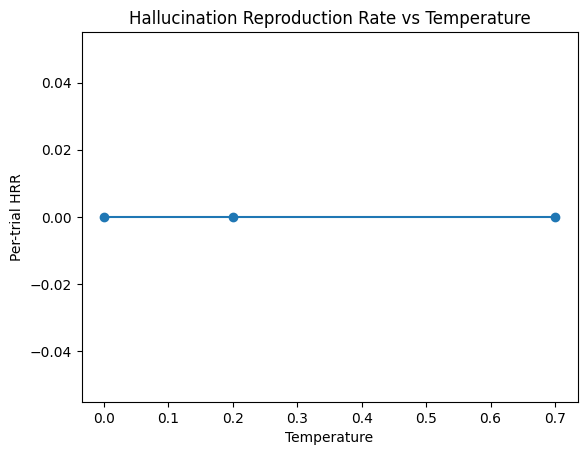

# Hallucination Reproduction Rate (HRR) Report

- **Model**: gpt-4o-mini
- **Dataset**: {a.dataset}
- **Generated**: 2025-08-19 03:20:41.249165

## Aggregate Results
Temperature | Per-trial HRR | 95% CI (Wilson) | Items | Trials | Hallucinations
:--:|:--:|:--:|--:|--:|--:
0.00 | 0.0% | 0.0–0.8% | 100 | 500 | 0
0.20 | 0.0% | 0.0–0.8% | 100 | 500 | 0
0.70 | 0.0% | 0.0–0.8% | 100 | 500 | 0

## Method (Short)
- N回生成し、ベンチマークの誤りスパン（normalized substring）出現率をHRRとして計測。
- item-wise平均とper-trial率を併記し、Wilson 95%CIを付与。
